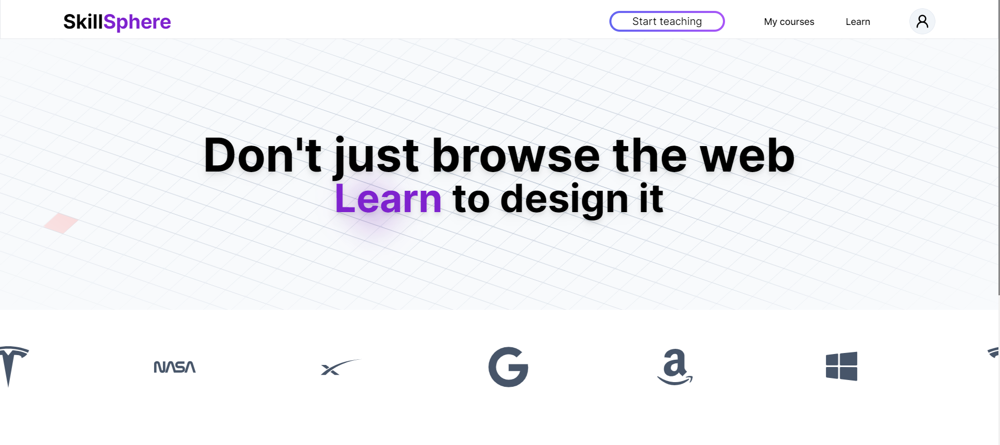
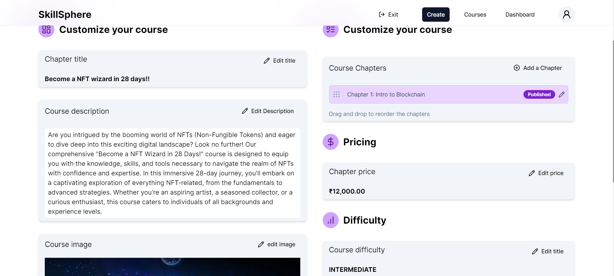
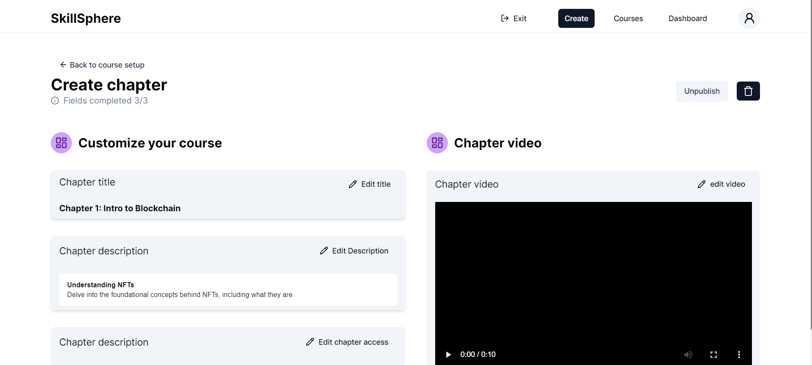
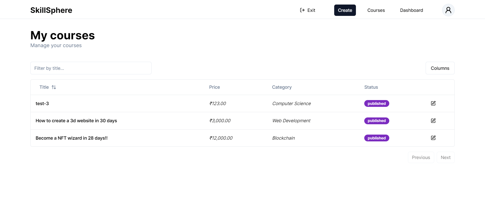
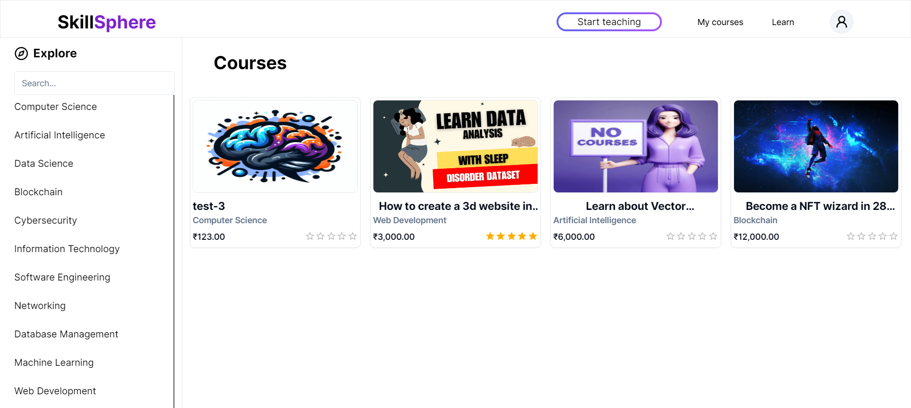
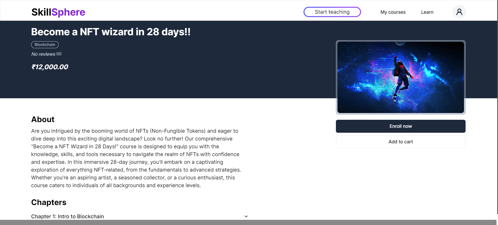
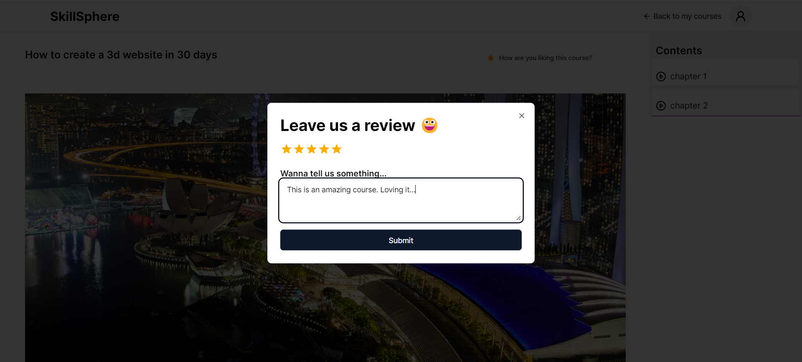

# What is SkillSphere?

SkillSphere is a learning platform where teachers/students can create courses and share their knowledge and educate the world. 

##### Tech stack: 
Nextjs 14, tRPC, Prisma, TypeScript, authjs v5 (nextauth), Stripe.
Tailwindcss, shadCN ui, MaterialUI, Zod.
<hr>

`Live link:` [https://skill-sphere-nine.vercel.app/](https://skill-sphere-nine.vercel.app/)

- To explore the application use this dummy login
    ```
    username: vishal@gmail.com
    password: 123123
    ```

The website might not load sometime as the deployment is done on a free plan.

In that case here is a preview of the applciation.



#### 1. Teacher

- Create a course

</br>

- Create chapters

</br>

- Publish and manage courses

</br>

#### 2. Students (Learners)
- Explore courses

</br>

- Select a course

</br>

- Purchase or enroll (free or paid) and start upskilling yourself.

</br>

- Start learning

</br>
    
<hr>

## Installation
First clone this repository. You can also fork this repository and then clone the forked one.
```ts
git clone https://github.com/Mvishal123/skill-sphere.git
```
Make sure you have Node Package Manager (npm) installed. Will work with most versions, but the latest (LTS) is recommended.

Now you need to install all the dependencies.
```ts
cd skill-sphere
npm install
```
You are done with the installation.

To run the website, use the following command
```ts
npm run dev
```
- The website will be live at https://localhost:3000

# Contributions are always welcomed.
- Raise issues.
- Make changes and make a PR.

 